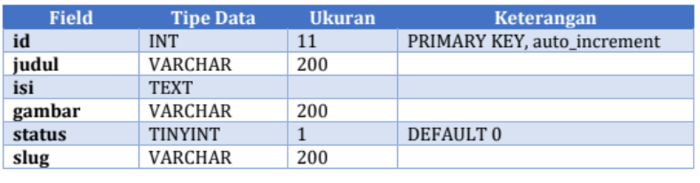
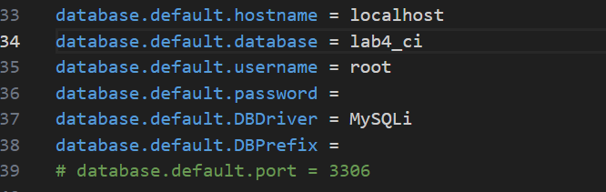
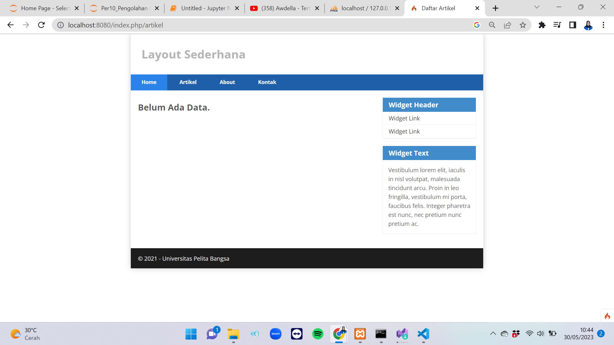
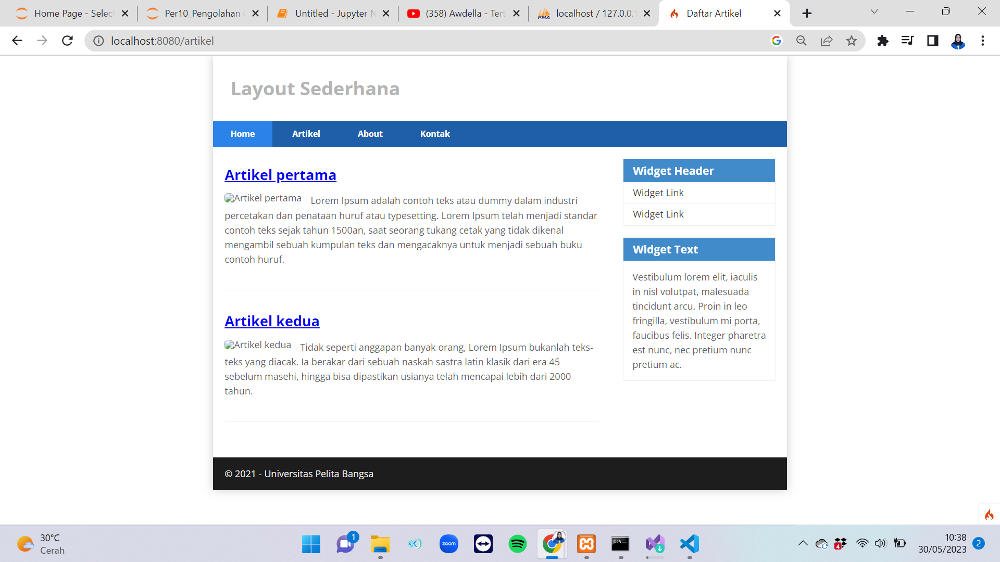
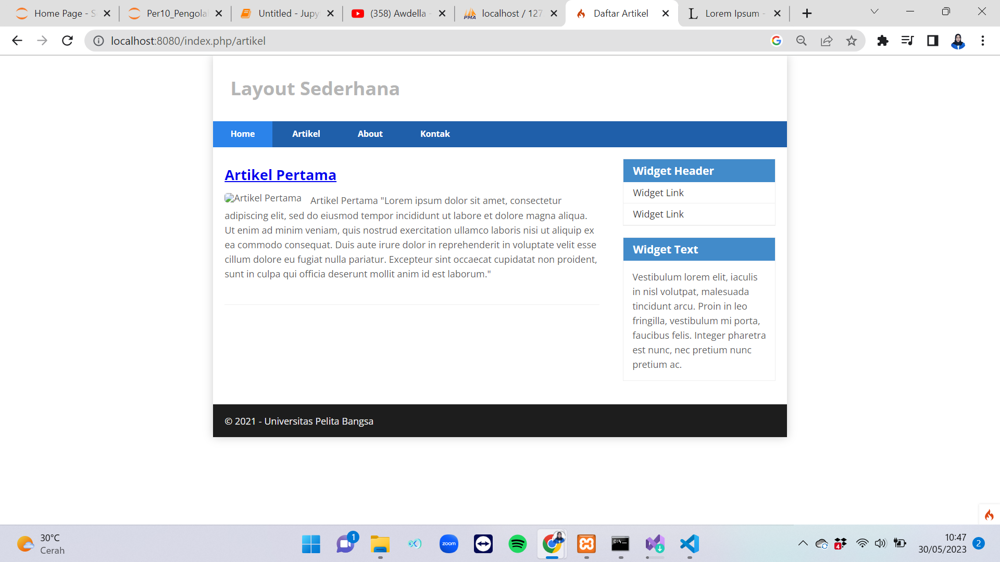
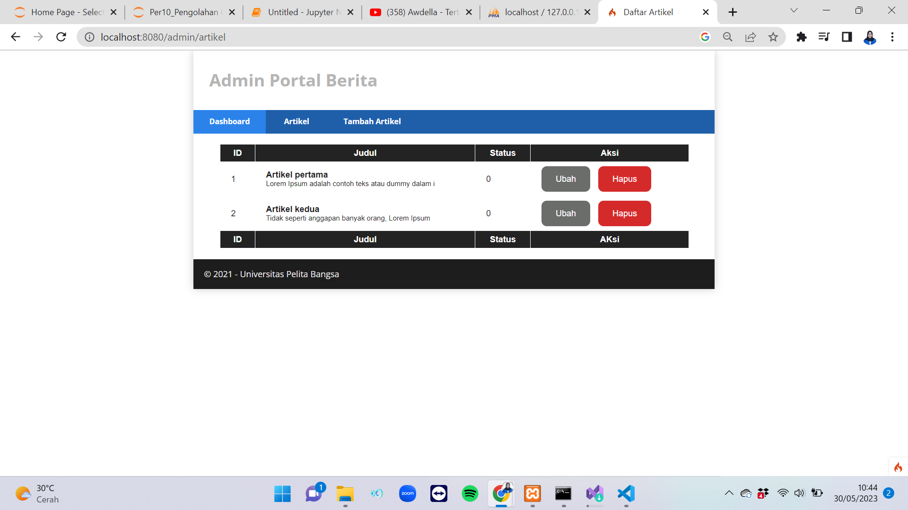
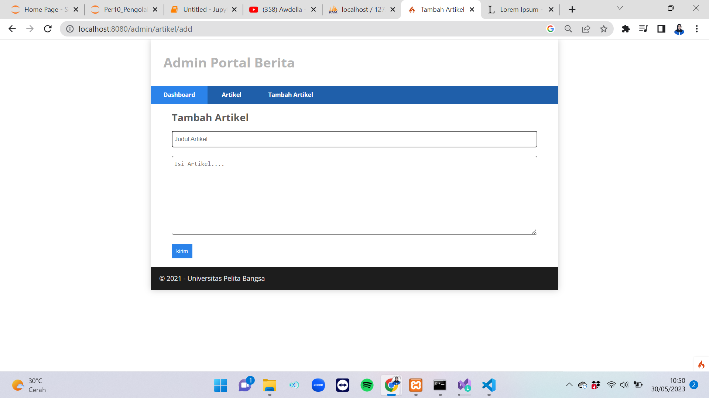
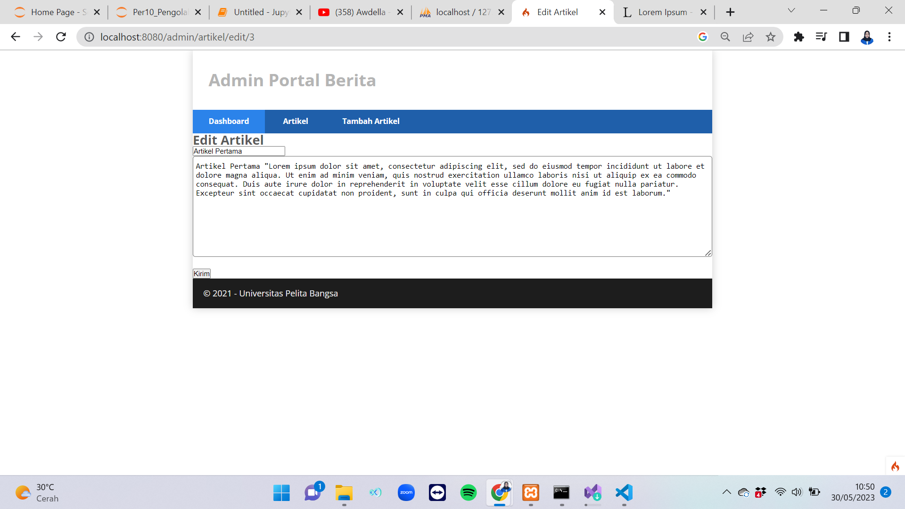

# Tugas Pemograman Web 2
## Profil
| #               | Biodata           |
| --------------- | ----------------- |
| **Nama**        | Zhafira A.K       |
| **NIM**         | 312110067         |
| **Kelas**       | TI.21.A.1         |
| **Mata Kuliah** | Pemrograman Web 2 |

# Langkah-langkah & Persiapan
<p>Untuk memulai membuat aplikasi CRUD sederhana, yang perlu disiapkan adalah Database Server
menggunakan MySQL. Pastikan MySQL Server sudah dapat dijalankan melalui XAMPP.</p>

# Membuat Database & Table
## Studi Kasus Data Artikel


1. Buat Database baru dengan nama `lab4_ci` dengan query berikut.
```sql
CREATE DATABASE lab_ci4;
```
2. Buat Table baru dengan nama `artikel` dengan query berikut.
```sql
CREATE TABLE artikel (
  id INT(11) auto_increment,
  judul VARCHAR(200) NOT NULL,
  isi TEXT,
  gambar VARCHAR(200),
  status TINYINT(1) DEFAULT 0,
  slug VARCHAR(200),
  PRIMARY KEY(id)
);
```

# Konfigurasi Koneksi Database
<p>Selanjutnya membuat konfigurasi untuk menghubungkan dengan Database Server. Konfigurasi dapat
dilakukan dengan dua cara: yaitu pada file app/config/database.php atau menggunakan file .env.
Pada praktikum ini kita gunakan konfigurasi pada file .env.</p>



# Membuat Model
<p>Selanjutnya adalah membuat Model untuk memproses data Artikel. Buat file baru pada direktori
app/Models dengan nama ArtikelModel.php, Kemudian masukan kode berikut.</p>

```php
<?php

namespace App\Models;

use CodeIgniter\Model;

class ArtikelModel extends Model
{
  protected $table = 'artikel';
  protected $primaryKey = 'id';
  protected $useAutoIncrement = true;
  protected $allowedFields = ['judul', 'isi', 'status', 'slug', 'gambar'];
}
```

# Membuat Controller
<p>Buat Controller baru dengan nama Artikel.php pada direktori app/Controllers.

```php
<?php

namespace App\Controllers;

use App\Models\ArtikelModel;
use CodeIgniter\Exceptions\PageNotFoundException;

class Artikel extends BaseController
{
    public function index()
    {
        $title = 'Daftar Artikel';
        $model = new ArtikelModel();
        $artikel = $model->findAll();
        return view('artikel/index', compact('artikel', 'title'));
    }
}
```

# Membuat View
- Buat direktori baru dengan nama artikel pada direktori app/Views, kemudian buat file baru dengan
nama index.php, Kemudian masukan kode berikut.

```php
<?= $this->include('template/header'); ?>
<?php
if ($artikel) :
  foreach ($artikel as $row) : ?>
    <article class="entry">
      <h2><a href="<?= base_url('/artikel/' . $row['slug']); ?>"><?= $row['judul']; ?></a></h2>
      " alt="<?= $row['judul']; ?>">
      <p><?= substr($row['isi'], 0, 1000); ?></p>
    </article>

    <hr class="divider" />
  <?php endforeach;
else : ?>
  <article class="entry">
    <h2>Belum Ada Data.</h2>
  </article>
<?php endif; ?>
<?= $this->include('template/footer'); ?>
```

- Selanjutnya buka browser kembali, dengan mengakses url http://localhost:8080/artikel



<p>Belum ada data yang ditampilkan. Kemudian coba tambahkan beberapa data pada database agar dapat
ditampilkan datanya.</p>

```sql
INSERT INTO artikel (judul, isi, slug) VALUE
('Artikel pertama', 'Lorem Ipsum adalah contoh teks atau dummy dalam
industri percetakan dan penataan huruf atau typesetting. Lorem Ipsum telah
menjadi standar contoh teks sejak tahun 1500an, saat seorang tukang cetak
yang tidak dikenal mengambil sebuah kumpulan teks dan mengacaknya untuk
menjadi sebuah buku contoh huruf.', 'artikel-pertama'),
('Artikel kedua', 'Tidak seperti anggapan banyak orang, Lorem Ipsum
bukanlah teks-teks yang diacak. Ia berakar dari sebuah naskah sastra latin
klasik dari era 45 sebelum masehi, hingga bisa dipastikan usianya telah
mencapai lebih dari 2000 tahun.', 'artikel-kedua');
```

- Refresh kembali browser, sehingga akan ditampilkan hasilnya.



# Membuat Tampilan Detail Artikel
<p>Tampilan pada saat judul berita di klik maka akan diarahkan ke halaman yang berbeda. Tambahkan
fungsi baru pada Controller Artikel dengan nama view().</p>

```php
public function view($slug)
 {
 $model = new ArtikelModel();
 $artikel = $model->where([
 'slug' => $slug
 ])->first();
 // Menampilkan error apabila data tidak ada.
 if (!$artikel)
 {
    throw PageNotFoundException::forPageNotFound();
}
$title = $artikel['judul'];
return view('artikel/detail', compact('artikel', 'title'));
}
```

# Membuat View Detail
<p>Buat view baru untuk halaman detail dengan nama app/views/artikel/detail.php, Kemudian masukan kode berikut.</p>

```php
<?= $this->include('template/header'); ?>

<article class="entry">

  <h2><?= $artikel['judul']; ?></h2>
  " alt="<?= $artikel['judul']; ?>">
  <p>
    <?= $artikel['isi']; ?>
  </p>
</article>

<?= $this->include('template/footer'); ?>
```

# Membuat Routing Untuk Artikel Detail
<p>Buka Kembali file app/config/Routes.php, kemudian tambahkan routing untuk artikel detail.</p>

```php
$routes->get('/artikel/(:any)', 'Artikel::view/$1');
```



# Membuat Menu Admin
- Menu Admin adalah untuk proses CRUD data artikel. Buat method baru pada Controller Artikel dengan
nama admin_index(), Kemudian masukan kode berikut.

```php
public function admin_index()
{
$title = 'Daftar Artikel';
$model = new ArtikelModel();
$artikel = $model->findAll();
return view('artikel/admin_index', compact('artikel', 'title'));
}
```

- Selanjutnya buat view untuk tampilan admin dengan nama admin_index.php

```php
<?= $this->include('template/admin_header'); ?> 
<link rel="stylesheet" href="<?= base_url('/style.css'); ?>">
<table class="table">
  <thead>
    <tr>
      <th>ID</th>
      <th>Judul</th>
      <th>Status</th>
      <th>Aksi</th>
    </tr>
  </thead>
  <tbody>
    <?php if ($artikel) : foreach ($artikel as $row) : ?>
        <tr>
          <td><?= $row['id']; ?></td>
          <td>
            <b><?= $row['judul']; ?></b>
            <p>
              <small><?= substr($row['isi'], 0, 50); ?></small>
            </p>
          </td>
          <td><?= $row['status']; ?></td>
          <td>
            <a class="btn" href="<?= base_url('/admin/artikel/edit/' . $row['id']); ?>">Ubah</a>
            <a class="btn btn-danger" onclick="return confirm('Yakin menghapus data ?');" href="<?= base_url('/admin/artikel/delete/' . $row['id']); ?>">Hapus</a>
          </td>
        </tr>
      <?php endforeach;
    else : ?>
      <tr>
        <td colspan="4">Belum Ada Data</td>
      </tr>
    <?php endif; ?>
  </tbody>
  <tfoot>
    <tr>
      <th>ID</th>
      <th>Judul</th>
      <th>Status</th>
      <th>AKsi</th>
    </tr>
  </tfoot>
</table> <?= $this->include('template/admin_footer'); ?>
```

- Tambahkan routing untuk menu admin seperti berikut:

```php
$routes->group('admin', function($routes) {
  $routes->get('artikel', 'Artikel::admin_index');
  $routes->add('artikel/add', 'Artikel::add');
  $routes->add('artikel/edit/(:any)', 'Artikel::edit/$1');
  $routes->get('artikel/delete/(:any)', 'Artikel::delete/$1');
});
```

- Akses menu admin dengan url http://localhost:8080/admin/artikel



# Menambah Data Artikel
- Tambahkan fungsi/method baru pada Controller Artikel dengan nama add().

```php
public function add()
{
// validasi data.
$validation = \Config\Services::validation();
$validation->setRules(['judul' => 'required']);
$isDataValid = $validation->withRequest($this->request)->run();
if ($isDataValid)
{
$artikel = new ArtikelModel();
$artikel->insert([
'judul' => $this->request->getPost('judul'),
'isi' => $this->request->getPost('isi'),
'slug' => url_title($this->request->getPost('judul')),
]);
return redirect('admin/artikel');
}
$title = "Tambah Artikel";
return view('artikel/form_add', compact('title'));
}
```

- Kemudian buat view untuk form tambah dengan nama form_add.php

```php
<?= $this->include('template/admin_header'); ?>
<link rel="stylesheet" href="<?= base_url('/style.css'); ?>">
<div class="add">
  <div class="title">
    <h2><?= $title; ?></h2>
  </div>
  <form action="" method="POST">
    <p>
      <input type="text" name="judul" placeholder="Judul Artikel....">
    </p>
    <p>
      <textarea name="isi" id="isi" cols="50" rows="10" placeholder="Isi Artikel...."></textarea>
    </p>
    <p><input type="submit" value="kirim" class="btn btn-large"></p>
  </form>
</div>

<?= $this->include('template/admin_footer'); ?>
```



# Mengubah Data
- Tambahkan fungsi/method baru pada Controller Artikel dengan nama edit().

```php
public function edit($id)
 {
 $artikel = new ArtikelModel();
 // validasi data.
 $validation = \Config\Services::validation();
 $validation->setRules(['judul' => 'required']);
 $isDataValid = $validation->withRequest($this->request)->run();
 if ($isDataValid)
 {
 $artikel->update($id, [
 'judul' => $this->request->getPost('judul'),
 'isi' => $this->request->getPost('isi'),
 ]);
 return redirect('admin/artikel');
 }
 // ambil data lama
 $data = $artikel->where('id', $id)->first();
 $title = "Edit Artikel";
 return view('artikel/form_edit', compact('title', 'data'));
 }
```

- Kemudian buat view untuk form tambah dengan nama form_edit.php

```php
<?= $this->include('template/admin_header'); ?>
<h2><?= $title; ?></h2>
<form action="" method="post">
 <p>
 <input type="text" name="judul" value="<?= $data['judul'];?>" >
 </p>
 <p>
 <textarea name="isi" cols="50" rows="10"><?=
$data['isi'];?></textarea>
 </p>
 <p><input type="submit" value="Kirim" class="btn btn-large"></p>
</form>
<?= $this->include('template/admin_footer'); ?>
```



# Menghapus Data
<p>Tambahkan fungsi/method baru pada Controller Artikel dengan nama delete().</p>

```php
public function delete($id)
{
  $artikel = new ArtikelModel();
  $artikel->delete($id);
  return redirect('admin/artikel');
}
```

## Pertanyaan dan Tugas
<p>Selesaikan programnya sesuai Langkah-langkah yang ada. Anda boleh melakukan improvisasi.</p>

## Laporan Praktikum
1. Melanjutkan praktikum sebelumnya pada repository dengan nama Lab7Web.
2. Kerjakan semua latihan yang diberikan sesuai urutannya.
3. Screenshot setiap perubahannya.
4. Update file README.md dan tuliskan penjelasan dari setiap langkah praktikum beserta
screenshotnya.
5. Commit hasilnya pada repository masing-masing.
6. Kirim URL repository pada e-learning ecampus.

## Terima Kasih!
